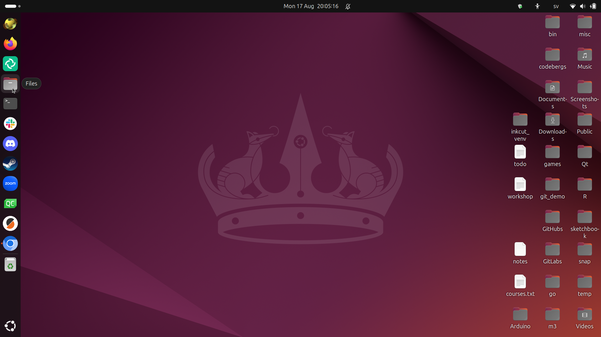
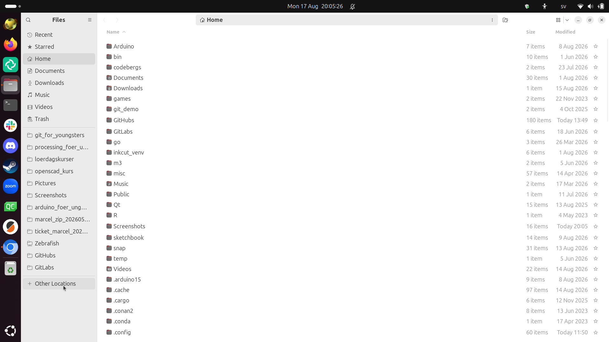
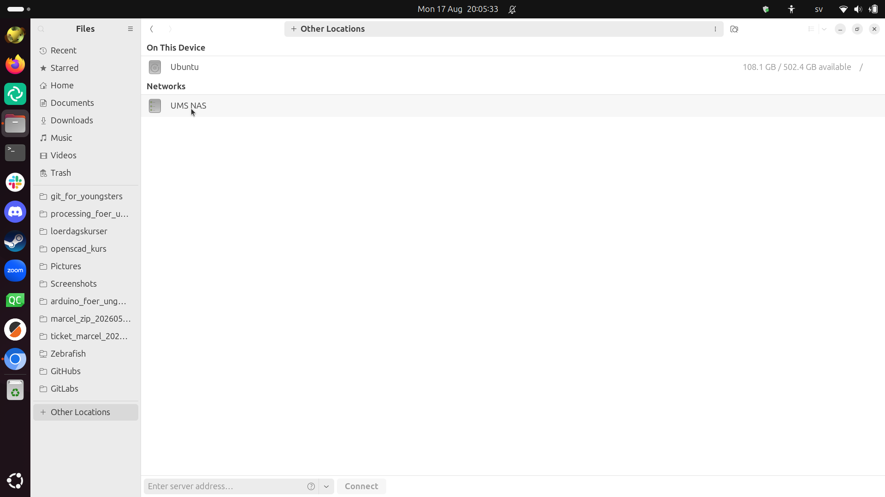
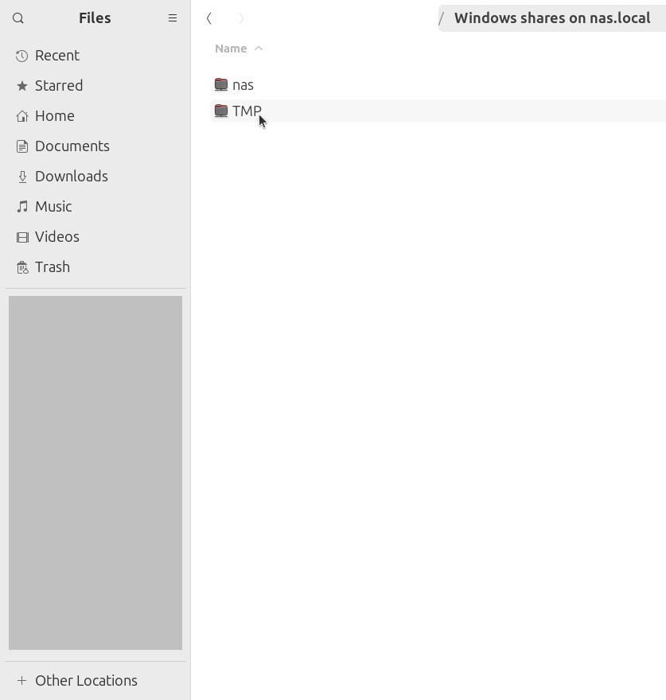
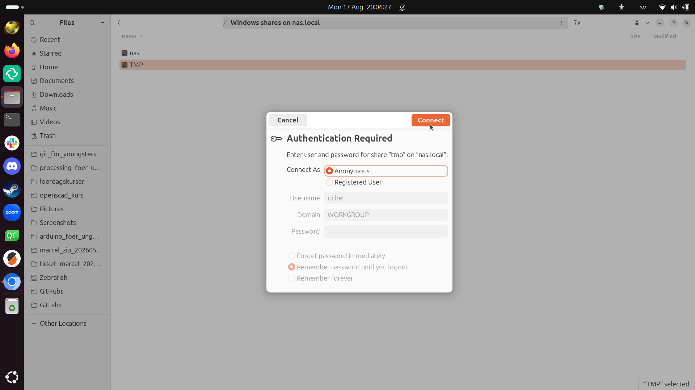
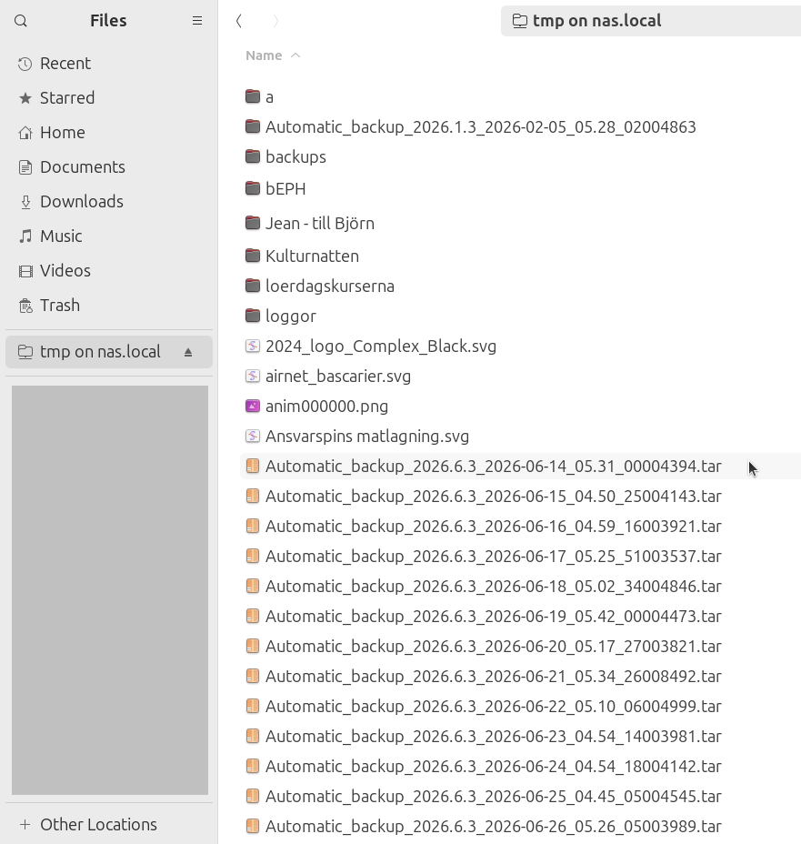

# Att förbinda med den UMS lokala file servern

Från Ubuntu desktoppen, clicka på 'Files'.

I 'Files', clicka på 'Other locations' för att ser andra ställe.

I 'Files', clicka på stället 'UMS NAS'.

I 'Files', clicka på UMS NAS stället kallade 'TMP'.

In pop-up dialogen, clicka på 'Connect'.

Nu är du förbindade med den UMS lokala fil servern!

